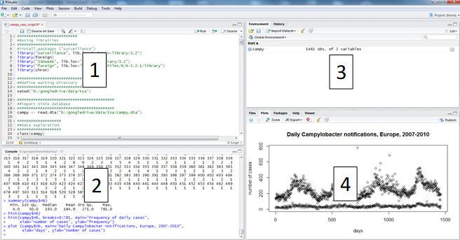
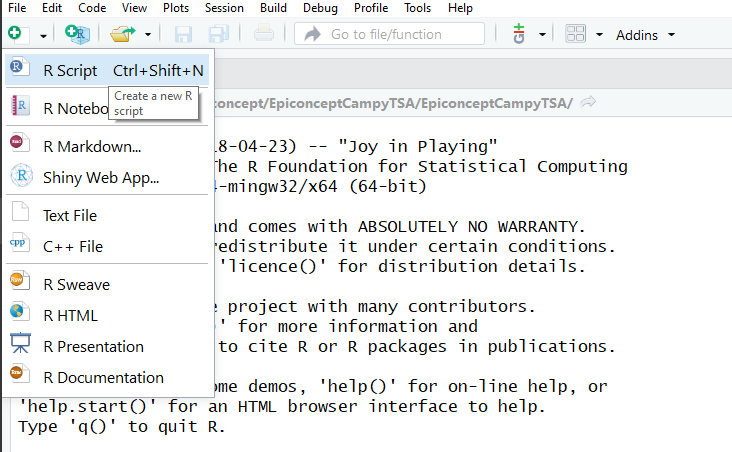
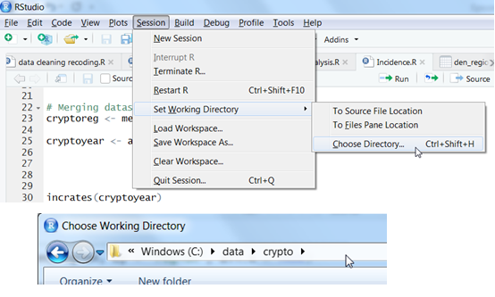
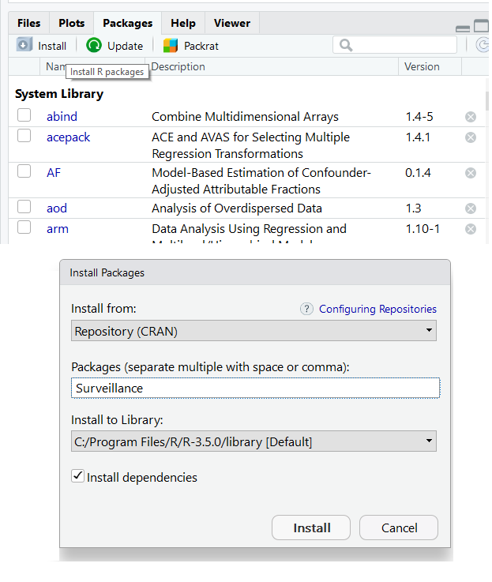
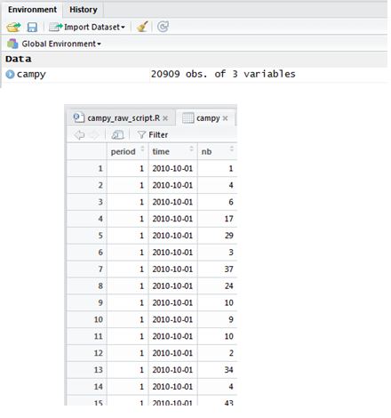
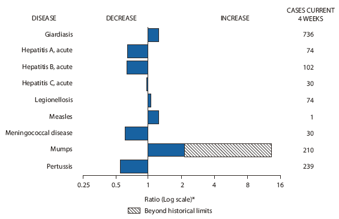

```{r setup, include = FALSE}
knitr::opts_chunk$set(echo = TRUE,
                      fig.width = 9,
                      fig.height = 6)
```

```{r setlang, eval = TRUE, echo = FALSE, results = 'hide'}
Sys.setlocale("LC_ALL", "english_UK")
```


```{r, echo = FALSE, warning= FALSE, message= FALSE}
#load packages
  #Those required for creating this markdown: 
    #"Worded": for styling and pagebreaks
    #"knitr": for styling tables
required_packages <- c("worded", "knitr") 

for (i in seq(along = required_packages)) {
  library(required_packages[i], character.only = TRUE)
}
```
 
<!---CHUNK_PAGEBREAK--->

# Copyright and License 

**Source:** 

This case study was designed under a ECDC contract for “Expertise in biostatistics for analysis of surveillance data”.
This tutorial was first designed by Esther Kissling, EpiConcept, April 2012 and was modified for R by Thomas Seyler, EpiConcept, July 2015. In 2018 the R version was re-worked by Alexander Spina (correction and updated); some parts of code were adapted from the EPIET time series analysis module case studies. 

**Revisions:** 

*If you modify this case study, please indicate below your name and changes you made*  

**You are free:** 

- **to Share** — to copy, distribute and transmit the work 
- **to Remix** — to adapt the work 

**Under the following conditions:** 

- **Attribution** — 	You must attribute the work in the manner specified by the author or licensor (but not in any way that suggests that they endorse you or your use of the work). The best way to do this is to keep as it is the list of contributors: sources, authors and reviewers. 
- **Share Alike** — 	If you alter, transform, or build upon this work, you may distribute the resulting work only under the same or similar license to this one. Your changes must be documented. Under that condition, you are allowed to add your name to the list of contributors. 
- You cannot sell this work alone but you can use it as part of a teaching. 

**With the understanding that:** 

- **Waiver** — Any of the above conditions can be waived if you get permission from the copyright holder. 
- **Public Domain** — 	Where the work or any of its elements is in the public domain under applicable law, that status is in no way affected by the license. 
- **Other Rights** — In no way are any of the following rights affected by the license: 
  - Your fair dealing or fair use rights, or other applicable copyright exceptions and limitations; 
  - The author's moral rights; 
  - Rights other persons may have either in the work itself or in how the work is used, such as publicity or privacy rights. 
- **Notice** — 	For any reuse or distribution, you must make clear to others the license terms of this work by keeping together this work and the current license. 

This licence is based on http://creativecommons.org/licenses/by-sa/3.0/
<!---CHUNK_PAGEBREAK---> 

## Objectives of tutorial 

At the end of the tutorial participants should be able to 

- create a plan of analysis for simple time series analysis;
- use R for exploratory time series analysis including installing the software, importing a dataset, setting time units for aggregation of time series, data checking, trend and seasonality analysis as well as analysis of residuals;
- understand how to create simple aberration detection algorithms, taking outbreaks into account. 

## Note on the dataset 

The dataset is an original dataset on Campylobacter disease in a European country that has been modified for training purposes. 

## Background to the tutorial 

The objective of the tutorial is to carry out an exploratory time series analysis on Campylobacter data using the TSA tool. The dataset is called *campy.csv*. 

The dataset gives the number of daily cases and contains a time, count and period variable. The table below shows the database dictionary: 

```{r, echo = FALSE}

kable( matrix( c(
"Variable name", "Variable type",	"Definition",
"time",	"Daily date",	"Date defined as 'Date used for statistics'",
"nb",	"Numeric",	"Number of reports",
"period",	"Numeric",	"The reporting period (e.g. 1=daily; 7=week; 30=month; 90=quarter; etc.)"
), ncol = 3, nrow = 4, byrow = T)
)


```

<!---CHUNK_PAGEBREAK---> 

# Question 1
Open the dataset (*campy.csv*) in R and briefly explore it (make sure your working directory is set in R). Import the necessary packages and install the corresponding packages.
With the assumption that the reporting in the dataset here is stable over time, create an outline of a mini-protocol for TSA, including hypotheses to be tested, a plan of analysis, with specifications for the dataset, inclusion/exclusion criteria, etc. 

<!---CHUNK_PAGEBREAK---> 


# Help Question 1 

**For information:** Background on Campylobacteriosis

Campylobacteriosis is a diarrhoeal disease caused by Campylobacter bacteria, found in animals such as poultry, cattle, pigs, wild birds and wild mammals. 

The most frequent way of getting infected is through the consumption of contaminated food (mainly poultry) or water. Other risk factors include swimming in natural surface-waters and direct contact with infected animals. 

After an incubation period 2-5 days (range 1-10 days) common symptoms are severe abdominal pain, watery and /or bloody diarrhoea and fever. Usually, symptoms last for a few days and the disease is self-limiting but occasionally they will persist and result in hospitalisation. Antimicrobial therapy is seldom needed. 

Campylobacter infection has been associated with complications such as later joint inflammation (5-10% of cases) and, on rare occasions, Guillian-Barre syndrome (a temporary but severe paralysis that may be total). 

As prophylactic measure, control of Campylobacter colonisation in poultry is important, as well as hygienic processing of meat, and the protection and control of private drinking water supplies. 

## R-Studio environment

*R-Studio* is an integrated development environment (IDE) for *R*. It includes a console, syntax highlighting editor that supports direct code execution, as well as tools for plotting, history, debugging and workspace management. You can download it freely from the [*R-Studio* website](https://www.rstudio.com/). 

The *RStudio* window comprises the following sections: 




1. A script which is equivalent to a do file in STATA or pgn in EpiInfo. 
2. A console where you can write commands and execute them, and where results other than graphs are shown.
3. A “Environment” and “History” windows where you can find the list of R objects being stored and the log of your session, respectively. 
4. The “Plots”, “Packages” and “Help” windows, for graphic visualisation, selection of installed packages and help documentation, respectively. 


## R-scripts
Throughout this case study we strongly encourage you to use *R-scripts* to keep track of the commands you are using to follow your plan of analysis. It will contain data management steps as well as descriptive and statistical analysis. 

Open R studio and open a new *R-script*. 
To open a new *R-script*, click on the plus button on the top left (below File), then select *R-script* from the drop-down menu. 

 


## Working directory 
Make sure you have created a working directory on your computer. This is where you store your data and your R scripts and outputs. An example of working directory could be “C:/data/crypto” if you are using a PC.
To set your working directory you can use the menu function by clicking "Session" > "Set Working Directory" > "Choose Directory..." and then you can select the appropriate folder. 

 

You could alternatively do this by adding code to your *R-script* (or the command line). 

You can check the path for your current working directory using the *getwd* function.

```{r, eval = FALSE}
#Check your current working directory
getwd()

```

To set your working directory you can use the *setwd* function. 

```{r, eval = FALSE}
#set working directory 
  #note the forward rather than backwards slashes
setwd("C:/data/crypto")

```


## Packages 

R comes with a set of default functions. However one of the strengths of R is that many user-written functions exist to help you do your work. To use them, you first need to install the package they belong to. 
To do this you can click on "Install" on the bottom right in the "Packages" window. 

 

<!---CHUNK_PAGEBREAK---> 

We will mainly use packages which come ready installed with R (base code), but where it makes things easier we will use add-on packages. All the R packages you need for the exercises can be installed over the Internet.

You will need to install these before starting. We will be using the following packages. 

- *ISOweek*: for adjusting dates and switching between units
- *surveillance*: for fitting time series and detection algorithms
- *zoo*: for producing rolling statistics 
- *moments*: for looking at skewness and kurtosis of time series


You can also install packages using the *install.packages* function, as below. Do not try to understand this code. 

```{r}
#choose packages required 
required_packages <- c("ISOweek", "surveillance", "zoo", "moments")
```
```{r, eval = FALSE}
# Installing required packages for this case study
for (pkg in required_packages) {
  if (!pkg %in% rownames(installed.packages())) {
    install.packages(pkg, dependencies = TRUE)
  }
}
```


You only need to install packages once. However you will need to load them each time you start a new session using the *library* function. 

```{r, eval = FALSE}
library(ISOweek)
```

Here too, you can load multiple packages at the same time within a loop; again do not try to understand this just yet, just appreciate it is possible. 

```{r, results = 'hide', message = FALSE, warning = FALSE}

# Loading required packages for this case study
for (i in seq(along = required_packages)) {
  library(required_packages[i], character.only = TRUE)
}
```

<!---CHUNK_PAGEBREAK---> 

## Reading in data 

Import the dataset from a comma separated value (.csv) file using the *read.csv* function, storing it as a data frame within *R* called campy. The arrow is used to assign the data frame to campy. 
Here we also specify that we do not want to read in string (character variables) as factors. 

```{r}
campy <- read.csv("campy.csv", stringsAsFactors = FALSE)
```


## Variable types
Campy is now a *R* object, of the data frame type. A data frame is simply the how datasets are classified in *R*, thus given class "data.frame". You can check the type of object by typing: class(campy)

Individual variables from the data frame are called using the name of the data frame followed by the **$** sign and the name of the variable. For instance, if you wish to enquire about the type of variables:  


```{r, eval = FALSE}
#check class of variable time
class(campy$time);

#check class of variable count
class(campy$count) 
```

You will notice that the time variable is of class "character". However we want this as a date. You can change this by overwriting the variable using the *as.Date* function. 

```{r}
#overwrite time variable as a date 
campy$time <- as.Date(campy$time)
```


# Browse data 

To browse the first six records you can use the *head* function. 

```{r, eval = FALSE}
#see first six rows of data 
head(campy)
```

To get summary statistics of all variables included in the data frame use the *summary* function.

```{r, eval = FALSE}
#see summary statistics of variables
summary(campy)
```

Alternatively you can view the data by clicking on the data by clicking on the data icon to the right of the view. 

 

You could achieve the same thing by using the *View* function (note the capital V). 

```{r, eval = FALSE}
#view your dataset 
View(campy)
```

<!---CHUNK_PAGEBREAK---> 

**Examples of hypotheses to be tested could be:** 

- Is there a trend in the Campylobacter reporting? 
- If yes, what type of trend is it? 
- Is there any seasonality in Campylobacter reporting? 
- If yes, around what time of the year does it occur? 
- Are the residuals white noise? Or are there other events than random variation? 

**Inclusion/exclusion criteria:** Only records with daily reporting will be considered (drop records with yearly reporting) 

**Time unit for analysis:** Weeks 

**Draft plan of analysis:** 

**Data cleaning** 

- Plot original data 
- Data description (frequency distributions, summary tables) of all variables 
- Checks for missing data 
- Checks for numeric attraction in reporting due to reporting bias, including statistical tests 

**Data description** 

- To better understand the nature of the data 
  - Plot the data 
  - Calculate statistical descriptors 
  - Checks for stationarity 
    - Check for constant mean (linear regression) 
    - Check for constant variance (mean vs. Variance plot) 
  - Checks for autocorrelation 
    - Autocorrelation 
    - Partial autocorrelation 
    - Correlogram
  - Checks for distribution 
    - Histogramme 
    - Symmetry plot 
    - Normal quantile plot 
    - Shapiro-Wilk normality test 
  - Checks for transformations
  - Moving average (exploring trend and seasonality) 
- Decomposition of the dataset 
  - Checks for trend (check R^2^) 
  - Checks for seasonality (taking trend into account) 
    - Spectral analysis, Periodogram 
    - Check R^2^ of models
- Residual analysis 
  - Plot residuals 
  - Statistical descriptors of residuals 
  - Checks for stationarity 
    - Check for constant mean (linear regression) 
    - Check for constant variance (mean vs. Variance plot) 
    - Plot of residuals against model 
  - Checks for autocorrelation 
    - Autocorrelation 
    - Partial autocorrelation 
    - Correlogram 
  - Checks for distribution 
    - Histogramme, Symmetry plot, Normal quantile plot 
    - Shapiro-Wilk normality test 
  - Test for white noise 
  - Depending on results of above analyses, carry out transformation, adjust trend/seasonality 
  - Possible: Simple modelling of data series with 95% CI, taking outbreaks into account (downweighting/removing)

<!---CHUNK_PAGEBREAK---> 

# Question 2 

Make any changes necessary to the dataset. Specify the appropriate time unit for aggregation (start with days). Carry out data checking, including tables and plots of all variables, checks for missing data and checks for numeric attraction by day of week and day of month for possible reporting bias. 
Interpret your findings. 

<!---CHUNK_PAGEBREAK---> 

# Help Question 2

In the current form, the data frame is daily counts (aggregate counts by date of notification). Dates are unique, i.e. there is only one count reported for each day. 
You could double check this using the *duplicated* function. 

```{r, eval = FALSE}
#plot counts by day
plot(campy$time, campy$count, 
     main = "Daily Campylobacter notifications, Europe, 2007-2010", 
     xlab = "days", ylab = "number of cases")
```

```{r, echo = FALSE}

#This is not shown to participants 
  #it is just to highlight the higher reporting in december 2008 

clr <- ifelse(campy$count < 700, "black", "red")[-length(campy$count)]

plot(campy$time, campy$count, col = clr, 
     main = "Daily Campylobacter notifications, Europe, 2007-2010", 
     xlab = "days", ylab = "number of cases")

```


This plot shows the original data. There do appear to be some outliers (e.g. increased reporting at the end of December 2008, highlighted in red). It would be interesting to investigate this further and also go back to the country to ask for more information.

Now check if there are missing values in the dataset. You could either do this with the *summary* function, as in question 1, or you could do the following to get counts of missings for the dataset. 

```{r}
# get counts of missing values in the dataset 
sum(is.na(campy))
```

To check for notification bias, let us plot the number of cases notified by day of the week. The first step is to extract the date of the week from the date (‘date’ variable) by creating a new variable "dayweek". If the language on your computer is not set to English, see the appendix for how to change this and get English days of the week. 

```{r}
#extract the weekdays from date
campy$dayweek <- weekdays(campy$time)
```


Make sure the days of the week are in the correct order by making it a factor variable with appropriate levels. 

```{r}
#change to factor with levels 
campy$dayweek <- factor(campy$dayweek, 
                        levels = c("Monday", "Tuesday", "Wednesday", 
                                   "Thursday", "Friday", "Saturday", "Sunday"))
```


You then need to use the *aggregate* function to collapse your dataset and get counts add the counts for each day together. 
In the below step, you could also not use the *with* function and instead specify the dataset within *aggregate*. However this produces less useful column names. 

```{r}
# using campy dataframe 
  # sum counts by day of the week 
campy_dayweek <- with(campy, aggregate(count ~ dayweek, FUN = sum))
```

Next make a bar chart of the number of cases per day of the week over the whole period. 
You can use the aggregated *campy_dayweek* data in the *barplot* function. You may not see all of the x-labels in the plot window, however if you click the "zoom" button these should appear. 

```{r}
# plot counts by day 
  # names.arg is required to label the x axis appropriately
barplot(campy_dayweek$count, names.arg = campy_dayweek$dayweek, 
        main = "Number of notified cases by day of the week", 
        xlab = "Day of the week", 
        ylab = "Cases")
```


Let us check for numeric attraction by day of the month (think of potential higher notification on the 1^st^ of the month for administrative purposes). As we have seen that there is much fewer notifications during weekends, let us exclude Saturday and Sunday from this analysis. We create a new object that is the copy of ‘campy’ but without all weekend records. 


```{r}
# keep rows from campy that are not saturday or sunday
campyw <- subset(campy, 
                 campy$dayweek != "Saturday" & campy$dayweek != "Sunday")
```

Create a new variable "daynum"", extracting the day of the month from the "time" variable. To do this use the *format* function and specify day using "%d".

We also need to change this to a numeric variable using the *as.numeric* function. 

```{r}
# create variable with day of month
  # "%d" specifies that day of month is what you want
campyw$daynum <- format(campyw$time, "%d")

# change to numeric 
campyw$daynum <- as.numeric(campyw$daynum)
```


We then need to aggregate the number of cases by day of the month, by creating a new data frame "campyw_daynum",

```{r}
# using campyw dataframe
  # sum counts by day
campy_daynum <- with(campyw, aggregate(count ~ daynum, FUN = sum))
```

Plot another bar chart. 

```{r}
barplot(campy_daynum$count, names.arg = campy_daynum$daynum, 
        main = "Notified cases by day of month (exluding weekends)",  
        xlab = "Day of the month", 
        ylab = "Cases")
```


There appears to be numeric attraction by day of week and day of month. The low number of notifications on Saturday and Sunday is likely due to the fact that some health care settings are closed on weekends. This is a strong argument to work with weekly cases. There also appears to be some higher magnitude of reporting on a Tuesday and on the 23^rd^. This may be influenced by the high reporting on the 23^rd^ of December 2008 (it is a Tuesday). You could do the plots on the data excluding 2008 to see if the graphs change.

<!---CHUNK_PAGEBREAK---> 

# Question 3 

Describe the time series: 

- Plot the time series aggregated by time unit of interest 
- Check the data for stationarity, autocorrelation , distribution and for possible transformations of the data. Interpret your findings and plan next steps. 
  - Note: we do not expect data to be stationary, autocorrelated or normally distributed before it has been decomposed. This is nevertheless an important part in descriptive analysis. 
- Use the “moving average” to explore possible trends and seasonality within the time series


<!---CHUNK_PAGEBREAK---> 

# Help Question 3

The first thing to do is to create a data frame where the counts are aggregated by week. Be careful, there are different methods to build the week of the year. Here we will use the *ISOweek* function (part of *ISOweek* package). 

```{r}
# create a variable with week 
campy$week <- ISOweek(campy$time)
```

Have a look at the new variable

```{r, eval = FALSE}
# look at first few rows
head(campy$date) 

# look at your dataset 
View(campy$date)
```

As before, use the aggregate function to sum the cases by ISO-week. 

```{r}
# using campy dataframe
  # sum counts by week
campy_week <- with(campy, aggregate(count ~ week, FUN = sum))
```

We will then create a Time-Series object. These are vector or matrices with class of "ts" (and additional attributes) which represent data that have been sampled at equispaced points in time. In the matrix case, each column of the matrix data is assumed to contain a single (univariate) time series. Working with a Time-Series object will make it easier to analyse the time series. We only keep the counts variable and then define the time unit of the new object by specifying the starting point (beginning of first week of 2007) and the frequency (52 weeks). 

```{r} 
# Create time series only using campy$week
campy_ts <- ts(campy_week$count, start = c(2007, 0), end = c(2010, 52), frequency = 52)
```

```{r, eval = FALSE}
# check the class of camp_ts
class(campy_ts)
```

You can visualise the data from the time series object, look at basic descriptive statistics and check for missing values. 

```{r, eval = FALSE}
# view your timeseries object 
campy_ts

# get descriptive statistics 
summary(campy_ts)

# check missings 
sum(is.na(campy_ts))
```

<!---CHUNK_PAGEBREAK---> 


Plot your time series. 

```{r}
# Plot time series by week 
plot(campy_ts, main = "Weekly cases, UK, 2007-2010", 
     ylab = "Number of cases", xlab = "Week of notification")
```

Examine the distribution of counts per week. 

```{r}
# plot histogram of counts occurences
hist(campy_ts)
```


Look at the summary statistics, as well as the skewness and kurtosis using the respective functions from the *moments* package. 

```{r}
# summary statistics
summary(campy_ts)

# look at the skewness
skewness(campy_ts)

# look at kurtosis
kurtosis(campy_ts)
```


The mean and median are not too different. There appears to be some skewness in the data. Kurtosis is around 3, which means there is a similar peak as in a normal distribution.


<!---CHUNK_PAGEBREAK---> 


## Checks for stationarity 

### Linear regression 

Simply speaking, a time series is stationary if its mean level and variance stay steady over time, or as explained by Hyndman and Athanasopoulos (2013): “[a] stationary time series is one whose properties do not depend on the time at which the series is observed”. 

We can use linear regression to check whether the mean is constant over time:
We first define the time variable as "t", ranging from week 1 to week 209, covering the whole period: 

```{r}
# define number of timepoints
t <- 1:209
```

We can then use our time-series data frame and the time variable in a linear regression using the *lm* function. 

```{r}
# run linear regression for counts over time
linreg <- lm(campy_ts ~ t) 
```


It is possible to apply the *summary* function to this regression in order to get a nicely formatted output. 

```{r}
# view output of regression
summary(linreg) 
```


There appears to be an upwards trend in the data. On average, there are 2.11 more cases notified every week. 
We can also use linear regression to check whether the variance is constant over time.

We first need to calculating a rolling standard deviation. In this case we choose a moving window of 10 weeks. This means that for each time point a standard deviation is calculated based on the five points before and after. 

```{r}
# produce a centred rolling standard deviation with 10 week window
variance <- rollapply(data = campy_ts, width = 10, FUN = sd, fill = NA)
```

```{r}

# run linear regression of standard deviation over time
variancereg <- lm(variance ~ t)

# view output of linear regression 
summary(variancereg)
```

There does not appear to be a significant difference in variance over time. 


<!---CHUNK_PAGEBREAK---> 

## Checks for autocorrelation

Does the series correlate with itself, and for what lags?

In order to do estimate autocorrelation we will use the *acf* function. This function also creates a plot, however we will not use the plotting function immediately. 

```{r}
# estimate autocorrelation without plotting
acplot <-  acf(campy_ts, plot = FALSE)
```

We then need to transform lags from years to weeks by multiplying the lag variable by 52 (number of weeks in a year). 

```{r}
# change lag from years to weeks
acplot$lag <- acplot$lag * 52
```

Then you can use the regular plot function to visualise these estimates. 
```{r}
# plot your autocorrelation graph
plot(acplot, main = "Autocorrelation", xlab = "Lag (week)")
```

The first line on this autocorrelation graph shows the correlation between each obsersation and itself (at lag zero, therefore always 1), the second shows correlation between each observation and the preceding one (lag one), and so on. 
Blue lines show the 95% confidence intervals. Where lines go above or below this there is significant autocorrelation (in order to produce a similar confidence intervals to Stata, add *ci.type = "ma"* to the *acf* function). 
This graph therefore shows substantial autocorrelation in the data. 

We now need to investigate possible seasonality (or periodicity). 
To do this we use the *pacf* function for partial autocorrelation. Essentially what this does, is adjust the autocorrelation in each observation for any autocorrelation from previous observations. 


```{r}
# estimate partial autocorrelation without plotting
pacplot <- pacf(campy_ts, plot = FALSE) 

# change lag from years to weeks
pacplot$lag <- pacplot$lag * 52

# plot your partial autocorrelation graph
plot(pacplot, main = "Partial Autocorrelation", xlab = "Lag (week)")

```

The partial autocorrelation graph shows autocorrelation at the first lag and further autocorrelation at around the 5th and 18/19th lag. The seasonal component of this time series needs to be examined. 

<!---CHUNK_PAGEBREAK---> 

## Checks for normality 

Begin by visually inspecting the data. 
We can plot a histogram of the data using *hist* and add a normal curve by combining the *curve* and *dnorm* functions. In this case we want to plot probability density rather than frequency on our histogram. 


```{r}
#plot your histogram defining labels and breaks
hist(campy_ts, probability = TRUE, 
     main = "Distribution with normal curve", 
     xlab = "counts", 
     breaks = 15
     )

#plot your normal curve on top
curve(dnorm(x, mean = mean(campy_ts), sd = sd(campy_ts)), 
            add = TRUE, col = "red", lwd = 2)
```

You can also inspect this using a normal quantile plot (or QQ-plot). To do this combine the *qqnorm* and *qqline* functions. If the dots do not follow the straight line then it is indicative of a non-normal distribution.

```{r}
# quantile plot for the data
qqnorm(campy_ts)
qqline(campy_ts)
```

Both of these plots show that the data is skewed and not normally distributed.

This can also be show statistically using the shapiro-Wilk test for normality. This shows significant deviation from normal, so we may need to consider transforming the data.  

```{r}
# run shapiro-wilk test on data
shapiro.test(campy_ts)
```

<!---CHUNK_PAGEBREAK---> 

## Check transformations

We will check transforming using square-root, log and square. 

First try the square-root using the *sqrt* function. 
```{r}
# check transformation by square-root 

# apply square-root to your dataset
sqrtcampy_ts <- sqrt(campy_ts)

# plot your histogram defining labels and breaks
hist(sqrtcampy_ts, probability = TRUE, 
     main = "square-root", 
     xlab = "counts", 
     breaks = 15
     )

# plot your normal curve on top
curve(dnorm(x, mean = mean(sqrtcampy_ts), sd = sd(sqrtcampy_ts)), 
            add = TRUE, col = "red", lwd = 2)


# run shapiro-wilk test on data
shapiro.test(sqrtcampy_ts)
```

Next try log transformation using the *log* function. 

```{r}

# check transformation by log 

# apply square-root to your dataset
logcampy_ts <- log(campy_ts)

# plot your histogram defining labels and breaks
hist(logcampy_ts, probability = TRUE, 
     main = "Log", 
     xlab = "counts", 
     breaks = 15
     )

# plot your normal curve on top
curve(dnorm(x, mean = mean(logcampy_ts), sd = sd(logcampy_ts)), 
            add = TRUE, col = "red", lwd = 2)


# run shapiro-wilk test on data
shapiro.test(logcampy_ts)

```

Finally, try transforming by the square by raising the data to the power of 2. 

```{r}


# check transformation by square 

# apply square-root to your dataset
sqcampy_ts <- campy_ts^2

# plot your histogram defining labels and breaks
hist(sqcampy_ts, probability = TRUE, 
     main = "Square", 
     xlab = "counts", 
     breaks = 15
     )

# plot your normal curve on top
curve(dnorm(x, mean = mean(sqcampy_ts), sd = sd(sqcampy_ts)), 
            add = TRUE, col = "red", lwd = 2)


# run shapiro-wilk test on data
shapiro.test(sqcampy_ts)

```

The transformation that renders the original time series most normal is the square root (W = 0.98762, p-value = 0.06633). However, does this transformation make sense? A log transformation and also no transformation should also be considered. 

<!---CHUNK_PAGEBREAK---> 


# Moving average 

We now want to use moving averages to investigate possible trends and seasonality. 
We can calculate these using the *rollapply* function. Similar to how we calculated the standard deviation when checking for variation over time. 
We will calculate the centred moving average for several different time windows. Try for example to do one each for 52 weeks, 26 weeks and 13 weeks. 

```{r}
# calculate annual moving average
ma52 <- rollapply(campy_ts, width = 52, FUN = mean)
```

We can then plot this using the *ts.plot* function. 

```{r}
# plot your timeseries with annual moving average
ts.plot(campy_ts, ma52, 
        main = "Weekly cases and moving average of 52 weeks, Campylobacter cases, 2007-2010", 
        ylab = "number of cases", 
        xlab = "week of notification")
```


Now try the same for a 26 week window. 

```{r}
# calculate 26 weekly moving average
ma26 <- rollapply(campy_ts, width = 26, FUN = mean)

# plot your timeseries with annual moving average
ts.plot(campy_ts, ma26, 
        main = "Weekly cases and moving average of 26 weeks, Campylobacter cases, 2007-2010", 
        ylab = "number of cases", 
        xlab = "week of notification")
```


And now do the same for a 13 week window. 

```{r}
# calculate 13 weekly moving average
ma13 <- rollapply(campy_ts, width = 13, FUN = mean)

# plot your timeseries with annual moving average
ts.plot(campy_ts, ma13, 
        main = "Weekly cases and moving average of 13 weeks, Campylobacter cases, 2007-2010", 
        ylab = "number of cases", 
        xlab = "week of notification")
```


It is also possible to decompose a time series automatically  into seasonal, trend and irregular components using moving averages with the *decompose* function. 

```{r}
plot(decompose(campy_ts))
```

In the UK, there appears to be an increasing annual trend in Campylobacter reports from 2007 to 2010 (this can be seen with the moving average of 51 weeks). There appears also to be an annual peak of reports in the summer (can be seen with the moving average of 25 weeks). The moving average window of 13 weeks, gives more information and shows that there appears to be a peak in early summer and a second smaller peak after the summer. 
Without more background it is difficult to judge whether the trend is a real trend, the peaks are real peaks or they are perhaps due to batch reporting. However a literature search indicates that Great Britain has marked seasonal peaks in Campylobacter enteritis occurring in May and September (“Investigation of Faecal Specimens for Bacterial Pathogens”; National Standards Methods, 2010. http://www.hpa-standardmethods.org.uk/documents/bsop/pdf/bsop30.pdf [Accessed October 2011]). 


<!---CHUNK_PAGEBREAK---> 


# Question 4 
Decompose the time series: 
- Decide on an appropriate trend to use 
- With the trend removed, analyse seasonality 
  - What seasonality will you include in a final model? Why?

<!---CHUNK_PAGEBREAK---> 

# Help Question 4 

## Regression type

We are using counts data, where sometimes Poisson regression or negative binomial regression (if overdispersion is present) may be indicated. However we have very high counts, with all counts per week exceeding 500. In addition, the histogram does not look particularly Poisson distributed. Therefore it may make sense to use linear regression in the first instance. At residual analysis stage we can then verify if this choice is appropriate. 
A next step may be to decide if the data follow a linear or a quadratic trend. Look at the graphs and regression outputs for both trends. 

First, define your time variable. The last time variable we defined by typing in the upper limit as a fixed value, however we can similarly make reference to the length of our time series object. 

```{r}
# define time variable (number of weeks) 
t <- 1:length(campy_ts)
```

We now run a linear regression as previously, showing the summary as well as the confidence intervals. 

```{r}
# run linear regression for counts over time
linreg <- lm(campy_ts ~ t) 

# view output of regression
summary(linreg) 

# view confidence intervals 
confint(linreg)
```

We can then plot the fitted values together with our observed data, similar to moving averages above, using the *ts.plot* function. 


```{r}
ts.plot(campy_ts, linreg$fitted.values, 
        col = c("black", "red"), 
        main = "linear trend")
```

For a quadratic model we need to first square our time variable and then run it together with the previous linear regression. 

```{r}
# create a new squared timed variable
t2 <- t^2

# run linear regression 
quadreg <- lm(campy_ts ~ t + t2)

# view output 
summary(quadreg) 

# plot with observed data 
ts.plot(campy_ts, quadreg$fitted.values, 
        col = c("black", "red"), 
        main = "linear quadratic trend")
```


The adjusted  R^2^ of the model with a quadratic trend (R^2^=0.106) is slightly low than the R^2^ of the model with a linear trend (R^2^= 0.109). However the difference between these values is minimal. In addition, R^2^ values do not take the complexity of the model into account (a quadratic model is more complex than a linear model). We can examine the Akaike Information Criterion (AIC), which takes model complexity into account. 

```{r}
# view linear regression AIC 
AIC(linreg) 

# view quadratic AIC
AIC(quadreg)
```


The AIC for the model with a linear trend is 3054.5 and the AIC for the model with quadratic trend is 3056.4 (the smaller the AIC the better the fit). The difference is negligible. We may want to use the principle of parsimony and continue our modelling using the simpler model, with the linear trend. 

Conclusions: 
In the overall dataset, we see an upwards trend over time, which we expected from the results of the moving average analysis. The regression output shows a coefficient of 2.11 which indicates an increase of 2.11 cases for each week in the dataset. The p-value is highly significant, which can also be a reflection of the high sample size. 
It appears that the trend is increasing, but we cannot conclude that without more information on the surveillance system and reporting practices. 
Please also note that for educational purposes we are using linear regression to model the trend here – linear regression may only be used if the data show no signs of overdispersion, which is rare in count data. However if counts are very high, then the distribution may approximate the normal distribution in which case it is OK to use linear regression. 
Furthermore, it is important that we have no missing data. If this were the case, it would be important to set actions for NA values when running the *lm* function (see the help section for more). 


<!---CHUNK_PAGEBREAK---> 


# Seasonality 

We will check for seasonality on the data after the trend is removed, however we get basically the same results if we check for seasonality on the original data.
We can find the most important periods in the data by doing a spectral analysis. This can be done using the *spec.pgram* function. By specifying *fast* as false, stops the function from "padding" the series with extra zeros to enable fast fourier transform. 


```{r}

# get spectrograme with detrended 
periodo <- spec.pgram(campy_ts, fast = FALSE)

```

To plot the periodogram appropriately we need to divide the frequencies by 52, as it is originally given in years. 

From the periodogram we can see that there may be several important periods. The first period of importance is obviously 52 weeks, after that we see 1 or 2 further important peaks. 

```{r}
# plot spectogram as weeks (rather than years)
plot(1/(periodo$freq/52), log(periodo$spec), 
      type = 'l',
      xlim = c(0, 209), 
      xlab = "Period (Weeks)", ylab = "Log(density)")
```


We can extract the frequencies with the highest peaks and extract the weeks  – note that you need to use the *order* function in combination with the negative sign to sort the output based on highest first. 

```{r}
# extract important weeks 
  # multiply by 52 because currently in years
1 / periodo$freq[order(-periodo$spec)] * 52

```

We can see that after a period of 52.25, the period of 17.4 is most important. This is approximately a third of a year, so this may be a plausible further period to explore. The next most important period is 26.1, which is around half a year, again a possible plausible period to explore.
Let’s just start with the most important period of 52.25 weeks. We can create a sine and cosine for this period and add it to our model with the linear trend. 

```{r}
# defining sine and cosine terms
sin52 <- sin(2 * pi * t / 52.25) 
cos52 <- cos(2 * pi * t / 52.25) 
```


Once you have defined your sine and cosine, you can add these to a linear regression as before. 


```{r}
# run linear regression for counts over time
linreg2 <- lm(campy_ts ~ t + sin52 + cos52) 

# view output of regression
summary(linreg2) 

# view confidence intervals 
confint(linreg2)
```

The adjusted R-squared is now around 0.71. This is a great improvement over the R-squared from the model just with a linear trend. 
The sine and cosine parameters are also statistically significant. 
We can look at the graph associated with the model. 

```{r}
ts.plot(campy_ts, linreg2$fitted.values, 
        col = c("black", "red"), 
        main = "Fitted trend 52 week period")
```


The model does not look too bad, but it does not capture the dual peaks that we see in the data. 
We can now see if a further period improves our model. We create further sine and cosine terms and can add these to the model. 


```{r}
# defining sine and cosine terms
sin17 <- sin(2 * pi * t / 17.4) 
cos17 <- cos(2 * pi * t / 17.4) 

# run linear regression for counts over time
linreg3 <- lm(campy_ts ~ t + sin52 + cos52 + sin17 + cos17) 

# view output of regression
summary(linreg3) 

# view confidence intervals 
confint(linreg3)
```

We can see that all sine and cosine terms are significant. The adjusted R-squared is around 0.81. The adjusted R-squared for the previous model was around 0.71 – therefore the new model is quite a big improvement. 


We can also compare the AIC for these models

```{r}
# show AIC for both models
AIC(linreg2)
AIC(linreg3)
```

The AIC for the model with the extra seasonal term is 2740.5, which is substantially lower than the AIC with only one seasonal term. 

<!---CHUNK_PAGEBREAK---> 


We can also plot the new model. 


```{r}
ts.plot(campy_ts, linreg3$fitted.values, 
        col = c("black", "red"), 
        main = "Fitted trend 52 and 17 week period")
```

This graphs explains the data better. We can see the double peak in the data around the late spring/summer and early autumn period. 
We also see a third “peak” at the beginning of the year, which we do not necessarily expect in terms of disease. This may however reflect changes in reporting around Christmas and Easter time. 
From the periodogram, we also saw that a period of 26 may also be an important period. We could try and see if adding this period improves the model substantially. 


```{r}
# defining sine and cosine terms
sin26 <- sin(2 * pi * t / 26.1) 
cos26 <- cos(2 * pi * t / 26.1) 

# run linear regression for counts over time
linreg4 <- lm(campy_ts ~ t + sin52 + cos52 + sin17 + cos17 + sin26 + cos26) 

# view output of regression
summary(linreg4) 

# view confidence intervals 
confint(linreg4)

# view AIC for regression 
AIC(linreg4)
```

The model including 3 periods still shows that all sine and cosine parameters are significant. The adjusted R2 is now around 0.84. While this is higher than the last model, which had an adjusted R-squared of around 0.81, it is not substantially higher. The AIC is around 2704, which is lower than the previous one at 2740 

<!---CHUNK_PAGEBREAK---> 

If we graph the model, we can see that the model fits the data well, but it is difficult to visually see the difference between the previous and current model. 


```{r}
ts.plot(campy_ts, linreg4$fitted.values, 
        col = c("black", "red"), 
        main = "Fitted trend 52 and 17 and 26 week period")
```

The model with just 2 seasonal terms may be an adequate model, given the principle of parsimony, however the model with 3 seasonal terms is interesting too. The detail of the model we are interested in depends on the objectives of our time series analysis. 
Before choosing a final model, we also need to analyse the residuals. 

<!---CHUNK_PAGEBREAK---> 

# Question 5 

Analyse the residuals of the model containing a linear trend and seasonality with two periods: 52.25 and 17.4 weeks.  
You can check for normality, check stationarity and for autocorrelation. 
What do you conclude? What would be your next steps? 


<!---CHUNK_PAGEBREAK---> 

# Help Question 5 


## Initial inspection 

We can extract the residuals quite simply from a linear regression and plot them. 
In this case we go back to linreg3 which contained periods of 52 and 17.33 weeks. 

```{r} 
# plot residuals of linear regression 
ts.plot(linreg3$residuals)
```


When looking at the residual plot it looks like there may be some leftover seasonality. Therefore we may want to bear in mind that the model with 3 seasonal terms may be better.


## Normality 


```{r}
#plot your histogram defining labels and breaks
hist(linreg3$residuals, probability = TRUE, 
     main = "Distribution of residuals with normal curve", 
     xlab = "counts", 
     breaks = 15
     )

#plot your normal curve on top
curve(dnorm(x, mean = mean(linreg3$residuals), 
            sd = sd(linreg3$residuals)), 
            add = TRUE, col = "red", lwd = 2)

```


```{r}
# run shapiro-wilk test on data
shapiro.test(linreg3$residuals)
```

The histogram is skewed to the right and the Shapiro-Wilk test for normality is significant, which tells us the data are not compatible with the normal distribution. We can also look at summary statistics. 


```{r}
# summary statistics
summary(linreg3$residuals)

# look at the skewness
skewness(linreg3$residuals)

# look at kurtosis
kurtosis(linreg3$residuals)
```


We see that there is some skewness in the data (it is positive, so it is skewed to the right) and also a kurtosis that is higher than 3. The mean and the median are different. This could indicate a presence of outbreaks. It may be worth revising the seasonality – to see if we adequately described seasonality.


## Stationarity 

If there is a trend in the dataset then it is not stationary. However we removed the trend with the regression earlier, so we are pretty sure that at least there is no linear trend left. 


```{r}

# regress residuals against time
residreg <- lm(linreg3$residuals ~ t) 


# view output of regression 
summary(residreg)

```

We could plot this regression against our residuals. 


```{r}

# plot residuals 
plot(linreg3$residuals) 

# add line from regression 
abline(residreg)

```

We can see that the coefficient is close to 0 and that slope is not statistically significant from a straight line. 

It would also be possible to investigate that the variance is constant by comparing variance against the mean. We could use a 5-week interval for this. 


```{r}

# calculate variance and mean means
varianceresid <- rollapply(linreg3$residuals, width = 5, FUN = var, fill = NA)
meanresid <- rollapply(linreg3$residuals, width = 5, FUN = mean, fill = NA)


# linear regression

residreg_mean <- lm(meanresid ~ varianceresid)

# view linear outcome 
summary(residreg_mean)

# plot regression 
plot(varianceresid, meanresid)
abline(residreg_mean) 

```

While there are some outliers, there are very few. Although signficant, the minimal slope of this regression shows that we can be happy that the residuals are stationary.

<!---CHUNK_PAGEBREAK--->

## Autocorrelation 


We can check for autocorrelation using the *acf* function. This function also creates a plot.

```{r}
# estimate autocorrelation without plotting
acplotresid <-  acf(linreg3$residual)
```

The ACF plot shows us that our data are highly correlated at early lags, which is expected from surveillance data. We also see that a seasonal pattern still remains in the residuals, even if it is not significant. 
This indicates that it may be worth checking the residuals of the model with the further seasonal term (of 26 weeks). 
And in fact, what we see that the normality of residuals is not improved in the model with 3 seasonal terms. The data remain stationary (no increasing variance with increasing mean). However the ACF plot is improved. There is still autocorrelation among the first few lags, but it is lower and we see less of a seasonal pattern remaining in the residuals. 

<!---CHUNK_PAGEBREAK---> 

# Question 6 

Using the model containing a linear trend and two seasonal periods at 52 and 17.33 weeks, model the data including 95% prediction interval and graph them. 

In a second step, downweight outliers that are above 2 standard deviations of the model. In public health models that downweight outliers a variety of weights are used. Here we will use a very simple weight of 1/(square of the standardised residuals). This means that the higher the outlier, the lower the weight will be assigned to them. Create the new model and 95% detection intervals and graph them. 

How do you interpret these models and what do you conclude?


<!---CHUNK_PAGEBREAK---> 


# Help Question 6 

Retrieving prediction intervals is possible using the *predict* function on your regression of choice. This can then be plotted along with your time series data as previously. 

```{r}

# retrieve your 95% prediction intervals from regression
pred_int <- predict(linreg3, interval = "prediction", level = 0.95)

# plot 
ts.plot(campy_ts, pred_int,
        col = c("black", "red", "blue", "blue"),
        main = "Original data, fitted values and 95% prediction interval")

legend("top", 
       lwd = 1, 
       horiz = TRUE, 
       col = c("black", "red", "blue"),
       legend = c("Observed", "Expected", "95%pi"))

```


So we can see that at certain points the data exceed the intervals. These outliers may represent outbreaks. However we have also been including these data points to estimate the model and the prediction intervals to determine what is expected. This will artificially inflate our prediction intervals. 


We could take these outliers into account when estimating our model and create 95% detection intervals around it. There are very many ways of taking outliers into account. Here we will use a simple method of downweighting outliers. This is an empirical approach and the weight given to the outliers can be adjusted according to how the model performs. 

This approach will be done in several steps: 

- We will identify outliers as those exceeding the model by 2 standard deviations. For this we will standardise our residuals. This means that we subtract the mean from the residual and divide this by the standard deviation of the residuals. 
- We will create a weight that will be defined as one for data points that are not outliers, and as 1/((standardised residual)^2^) for outliers. 
- We will create a new variable for counts that will contain the original counts, but with the outliers downweighted. These outliers will be defined as 2 standard deviations above the model plus the exceedance above this weighted by the weighting factor. 


```{r, warning = FALSE}

# extract the standard deviations for each point
stdres <- residuals(linreg3) / sigma(linreg3)

# create weights 
  # if standard deviation greater than 2 then
  # 1 / stdres^2 otherwise 1
wts <- ifelse(stdres > 2, 
              1 / (stdres^2), 1)


# modify counts 
campy_tswtd <- campy_ts * wts


# run linear regression for counts over time
linreg3wtd <- lm(campy_tswtd ~ t + sin52 + cos52 + sin17 + cos17)


# retrieve your 95% prediction intervals from regression
pred_intwtd <- predict(linreg3wtd, interval = "prediction", level = 0.95)

# plot 
ts.plot(campy_ts, pred_intwtd,
        col = c("black", "red", "blue", "blue"),
        main = "Original data, fitted values and 95% prediction interval")

legend("top", 
       lwd = 1, 
       horiz = TRUE, 
       col = c("black", "red", "blue"),
       legend = c("Observed", "Expected", "95%pi"))

```


The difference between the model not taking and taking outliers into account is not large in this example. Depending on your objectives for time series analysis, you can adjust the weighting and the definition of what is an outlier (e.g. from 2 standard deviations to 1.5 standard deviations). This can lead to a more or less sensitive model. 


<!---CHUNK_PAGEBREAK--->  

# Question 7 

Using the *surveillance package*, try other detection algorithms and compare how they perform (sensitivity, specificity, positive predictive value) by varying their parameters: 

- The Early Aberration Detection System (EARS) used by CDC 
- The CDC algorithm used by CDC 
- The Farrington method used by PHE 
- The CUSUM method 
- The GLRNB method

<!---CHUNK_PAGEBREAK--->  

# Help Question 7 


## Creating a *sts* object for using surveillance package 

This section is based on *Salmon, Schumacher and Höhle, 2014*. They provide a good overview of the surveillance package and the detection algorithms they use. The first step is to create a surveillance time series object (*sts*) based on our weekly aggregates, similarly to how we made a time series object previously. 

```{r}

# define surveillance time series object
campy_sts <- sts(observed = campy_week$count,
                 start = c(2007, 1), 
                 freq = 52)
```

## EARS C1 algorithm 

This method is suitable when few historical data are available, but does not adjust for trend, seasonality, nor does it take into account past outbreaks. The baseline is the 7 time points before the assessed time point $t_0$. The expected value is the mean of the baseline. The method is based on a statistic called $C_{t_0}$ defined as: 

$$ C_{t_0} = \frac{(y_{t_0} - \bar{y}_{t_0}) } {s_{t_0}} $$

where: 


$$ \bar{y}_{t_0} = \frac {1}{7} \cdot \sum_{i=t_0 - 7}^{t_0 - 1} y_i$$

$$ s_{t_0}^2 = \frac {1}{7-1} \cdot \sum_{i=t_0 - 7}^{t_0 - 1} (y_i - \bar{y}_{t_0}) ^2 $$

Under the null hypothesis of no outbreak, we assume that $C_{t_0}$ is normally distributed with a mean of 0 and standard deviation of 1. The upper bound $U_{t_0}$ is defined by a confidence interval of $(1 \times \alpha) \times 100$  for the mean: 

$$ U_{t_0} = \bar{y}_{t_0} + z_{1-\alpha} \cdot s_{t_0} $$

An alarm is raised if $y_{t_0} > U_{t_0}$. To apply the detection algorithm in R, you first need to construct a control slot that defines some of the parameters (range, method, the alpha error, etc...) of the algorithm. 

<!---CHUNK_PAGEBREAK---> 

```{r}
# define control
ctrl <- list(range = 8:209, 
             method = "C1",
             alpha = 0.05) 
```

We can then use the *earsC* function from the surveillance package. 

```{r}
# apply EARS C1 algorithm 
earmethod <- earsC(campy_sts, control = ctrl)
```

You can also plot the outcome of this algorithm. 

```{r}
# plot your counts with algorithm applied 
plot(earmethod, 
     main = "EARS method, 7 weeks, alpha 0.05",
     legend.opts = list("top", horiz = TRUE))
```

<!---CHUNK_PAGEBREAK---> 

# CDC algorithm - Historical Mean Method (Stroup et al, 1989) 

This signal detection method is used on a weekly basis by CDC (see example of output below). It is based on the totals from previous, comparable, and subsequent 4-week periods for the past 5 years. In our case, we cannot go as far as 5 years in the past; we will build our baseline using the past 2 years. This method does not adjust for trend and does not adjust for past outbreaks. 

When alpha is set to 0.05, the historical limit is computed as:

$$ x + 1.96 \cdot std(x)$$

Selected notifiable disease reports, US, comparison of provisional 4-week totals, March 6 2010 with historical data

 

* Ratio of current 4-week total to mean of 15 4-week totals (from previous, comparable, and subsequent 4-week periods for the past 5 years). The point where the hatched area begins is based on the mean and two standard deviations of these 4-week totals. 


To apply the CDC detection algorithm we need to create *disProg* object from our *sts* object. 

```{r}
# create a disprog object 
campy_stsd <- sts2disProg(campy_sts)
```


```{r}
# apply the cdc algorithm 
cdcmethod <- algo.cdc(campy_stsd, 
                      control = list(range = 130:209, b = 2, m = 4, alpha = 0.05))

```

You can also plot the outcome of this algorithm. 

```{r}
plot(cdcmethod,
     main = "CDC Historical Mean Method, b=2 years, m=4 weeks, alpha 0.05",
     legend.opts = list(x = "top", horiz = TRUE))
```


It is clear from this plot that the x-axis labels of time are not correct. This appears to be an in-built error of the package and can be corrected as below. 

```{r}
# define the start week and year for your plot labels
  # nb. %% is the modulus
syear <- floor(cdcmethod$disProgObj$start[1] + 130 / cdcmethod$disProgObj$freq)
sweek <- -((cdcmethod$disProgObj$start[2] + 130) %% cdcmethod$disProgObj$freq)

# plot your counts with algorithm applied 
plot(cdcmethod, startyear = syear, firstweek = sweek,
     main = "CDC Historical Mean Method, b=2 years, m=4 weeks, alpha 0.05",
     legend.opts = list(x = "top", horiz = TRUE))
```

<!---CHUNK_PAGEBREAK---> 

# Farrington algorithm - used by PHE 

This method fits an over-dispersed Poisson generalized linear model with log link to the reference data. It takes seasonality into account by using a subset of the available data as reference data for fitting the model: $w$ time points centered around the time point located $1, 2, \dots, b$ years before $t_0$, amounting to a total $b*(2w+1)$ reference values. It is better to exclude the most recent weeks before $t_0$ from the baseline in order to avoid reducing sensitivity when an outbreak has started recently before $t_0$ (`pastWeeksNotIncluded`). The time trend is included only when significant at a chosen level `pThresholdTrend`, when there are more than three years reference data and if not overextrapolation occurs because of the time trend. Past outbreaks are reweighted based on their Anscombe residuals. If the Anscombe residuals of a count is higher than `weightsThreshold` it is reweighted accordingly in a second fitting of the linear model.

```{r}

# define control
ctrl <- list(range = 130:209,
             b = 2, w = 4, 
             weightsThreshold = 2.56,
             pastWeeksNotIncluded = 3,
             pThresholdTrend = 0.05,
             thresholdMethod = "delta")

# apply farrington flexible method 
farringtonmethod <- farringtonFlexible(campy_sts, ctrl)

# plot your counts with algorithm applied 
plot(farringtonmethod, 
     main = "Farrington method, 2 years, 4 weeks, alpha 0.01",
     legend.opts = list("top", horiz = TRUE))
```

<!---CHUNK_PAGEBREAK---> 

# CUSUM  – used to detect sustained shift in the underlying process

The CUSUM algorithm is a technique of statistical process control (SPC). It assumes a two-state situation, so-called in-control and out-of-control (i.e. an outbreak) and we assume different distribution of case counts in both states. The aim of the CUSUM is to find the point where the distribution changes. As we are dealing with a time series with underlying seasonality we need to define `m` as `glm` to control for it.

```{r}
# define control range and method
ctrl <- list(range = 130:209,
             m = "glm")

# apply cusum algorithm 
cusummethod <- algo.cusum(campy_stsd, control = ctrl)
```

Here too there is an error with axis labels and this can be corrected as below before plotting. 

```{r}
# correct start week and year for axis labels
syear <- floor(cdcmethod$disProgObj$start[1] + 130 / cdcmethod$disProgObj$freq)
sweek <- -((cdcmethod$disProgObj$start[2] + 130) %% cdcmethod$disProgObj$freq)

# plot with algorithm applied
plot(cusummethod, startyear = syear, firstweek = sweek,
     main = "CUSUM method",
     legend.opts = list(x = "top", horiz = TRUE))
```

<!---CHUNK_PAGEBREAK---> 

# GLRNB method 

This method is a synthesis of traditional methods like the Farrington algorithm and statistical process control algorithms like CUSUM. The idea is to combine the possibility to detect sustained shifts with the ability of taking overdispersion or seasonality into account. You need to split your data into two phases, where phase one is  used for fitting a GLM model. Technically, in the `glrnb` functions, the time period defined in the `range` option will be phase 2 and everything before it will be considered phase 1.

```{r, results = 'hide'}
# define your period of interest
phase2 <- 130:209

# define control options
ctrl <- list(range = phase2, c.ARL = 4, theta = log(1.4), ret = "cases",
               mu0 = list(S = 1, trend = TRUE, refit = FALSE))

# apply the algorithm
glrnbmethod <- glrnb(campy_sts, control = ctrl)
```

```{r}
# plot with algorithm applied
plot(glrnbmethod, main = "GLRNB method",
     legend.opts = list("top", horiz = TRUE))
```

<!---CHUNK_PAGEBREAK---> 

# Comparing algorithms 


It is then possible to compare the various algorithms using the *algo.compare* function. 
```{r}
# list algorithms used 
campy_algos <- list(earmethod, cdcmethod, cusummethod, farringtonmethod, glrnbmethod)

# compare algorithms
algo.compare(campy_algos)
```


# Appendix


## Setting system language to english 

The following code changes your R system locales to English. This is only done for the current session, so each time you open a new R session you would need to set it to English. 
For a list of language options and the strings to enter see the [windows website](https://docs.microsoft.com/en-us/cpp/c-runtime-library/language-strings?view=vs-2017).

```{r, eval = FALSE}
Sys.setlocale("LC_ALL", "english_UK")
```

In order to permanently change your language settings for R (so that you do not need to reset this each time) you have to change your startup settings. To do this (on Windows OS), copy and paste the above line of code in to your *Rprofile.site*, which you would find in the R > etc folder. Normally this would be in programme files but it depends where you installed R. 
